# DevOps Flask CI/CD + Kubernetes

## Overview
Project ini membangun **CI/CD pipeline lengkap** menggunakan GitHub Actions untuk otomatisasi build, test, dan push Docker image aplikasi Flask. Kemudian deploy ke Kubernetes (Minikube) dengan rolling update zero-downtime.  
Tujuannya: mengubah deployment manual menjadi satu command push-to-deploy — sesuai kebutuhan on-prem/hybrid.

## Tech Stack
- Backend: Flask (Python)
- Container: Docker
- CI/CD: GitHub Actions
- Orchestration: Kubernetes (Minikube)
- Documentation: Markdown + Mermaid

## Flowchart Diagram
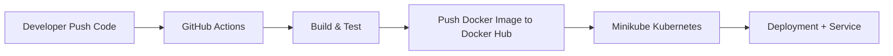
---
## Milestone 1 - Flask app
- Setup Repo Github
- Flask app sederhana dengan health check

### How to Run Locally
```bash
git clone https://github.com/seizenz7/devops-flask-ci-cd-kubernetes.git
cd devops-flask-ci-cd-kubernetes
python3 -m venv venv
source venv/bin/activate
pip install -r requirements.txt
python app.py
```

### Screenshots (Flask app)
Flask Home \
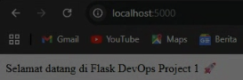 \
Health Check \
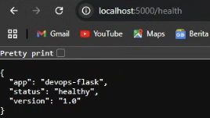

### Challenges & Learning
- Challenge: Mengatur virtual environment dan GitHub repo di WSL Windows
- Learning: Menggunakan virtual environment + requirements.txt membuat project selalu reproducible dan mudah diaudit
---
## Milestone 2 - Docker
- Dockerfile dengan layer caching + HEALTHCHECK menggunakan /health endpoint
- Image berhasil di-build & di-run lokal

### How to Run with Docker
```bash
docker build --no-cache -t devops-flask:latest .
docker run -d -p 5000:5000 devops-flask
```

### Screenshots (Docker)
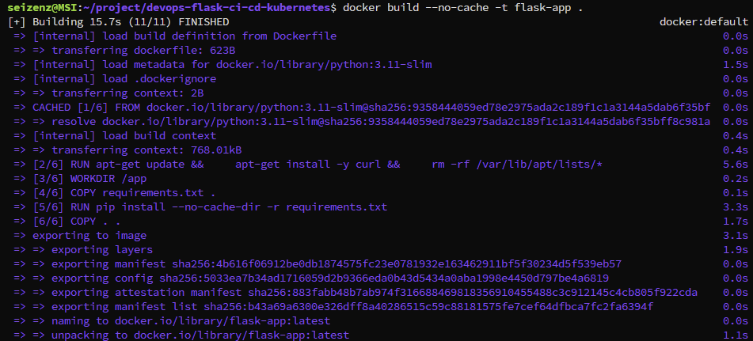
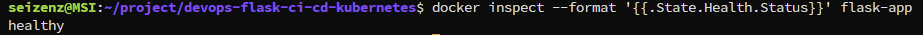

### Best Practice Dockerfile (✓ Applied)
- Specific slim image
- Layer caching
- Non-root user
- Clean cache
- HEALTHCHECK

### Challenges & Learnings 
- Challenge:
  - Health check status Unhealthy karena curl not found di container
  - Mengubah ke non-root user + clean cache
- Learning:
  - Selalu rebuild dengan --no-cache setelah ubah Dockerfile — ini kebiasaan penting untuk reproducibility di lingkungan on-prem
  - Dockerfile best practice meningkatkan security dan efisiensi build 

---

## Milestone 3 - GitHub Actions CI/CD 
- Pipeline otomatis build, test, dan push ke Docker Hub
- Best practice: caching layer, multi-tag (latest + SHA), Docker Buildx

### Screenshots (GitHub Actions)
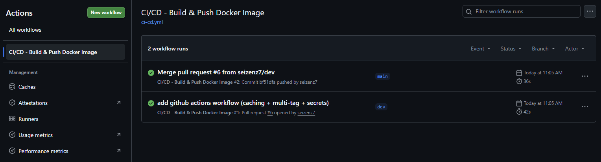
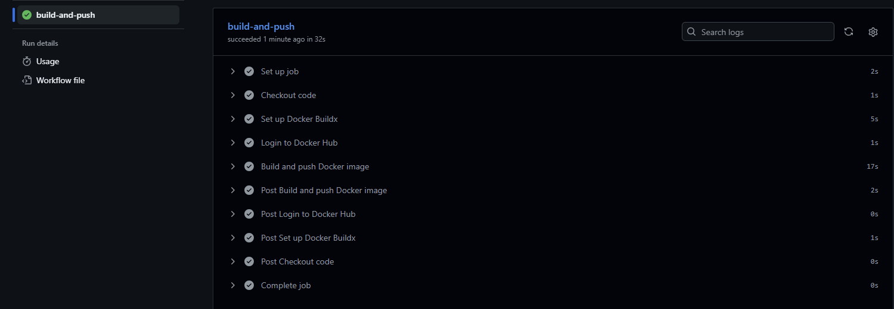
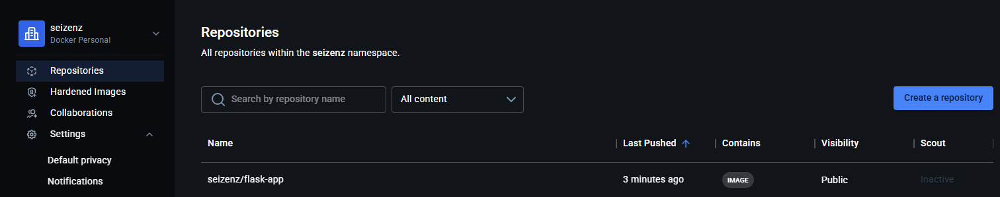

### Challenges & Learnings 
- Challenge: Setup secrets dan caching Docker
- Learning: GitHub Actions + layer caching membuat build jauh lebih cepat dan reproducible

---

## Milestone 4 - Kubernetes 
- Declarative manifests (Deployment + Service)
- RollingUpdate zero-downtime
- Readiness & Liveness probes
- Resource requests & limits
- Non-root container (dari Dockerfile best practice)

### Screenshots (Kubernetes)
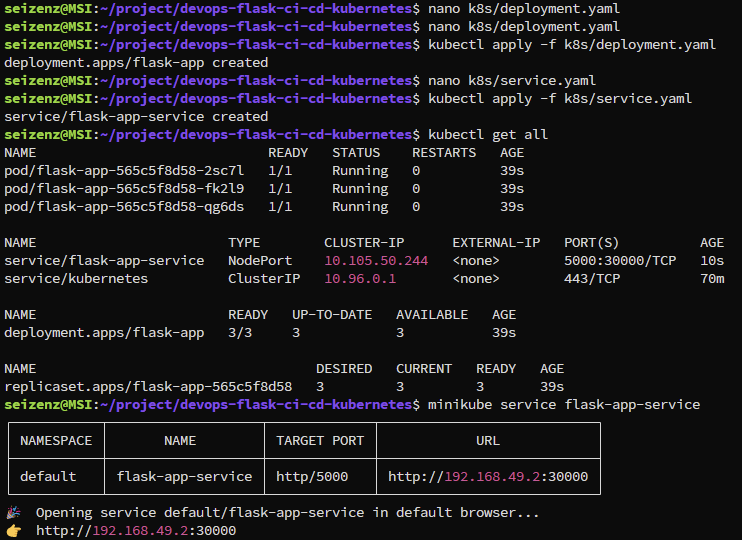
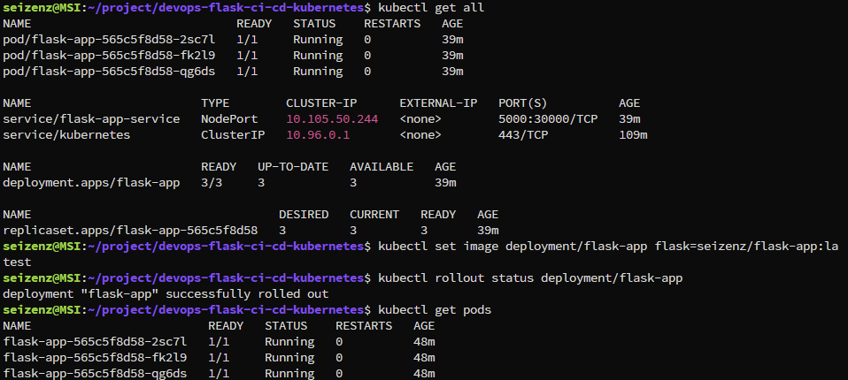
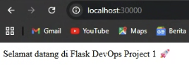

### Challenges & Learnings (Kubernetes)
- Challenge: Mengatur probes dan securityContext (`runAsNonRoot`, `readOnlyRootFilesystem`)
- Learning: Kubernetes declarative + rolling update 
---
## ***Key Takeaway Keseluruhan Project 1***
Project ini mengubah saya dari "bisa install Docker dan Kubernetes" menjadi paham end-to-end DevOps mindset: reproducibility, security by design, automation, dan zero-downtime deployment
