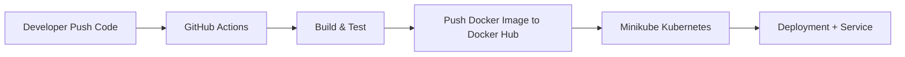

# DevOps Flask CI/CD + Kubernetes

## Overview
Project ini membangun **CI/CD pipeline lengkap** menggunakan GitHub Actions untuk otomatisasi build, test, dan push Docker image aplikasi Flask. Kemudian deploy ke Kubernetes (Minikube) dengan rolling update zero-downtime.  
Tujuannya: mengubah deployment manual menjadi satu command push-to-deploy — sesuai kebutuhan on-prem/hybrid.

## Tech Stack
- Backend: Flask (Python)
- Container: Docker
- CI/CD: GitHub Actions
- Orchestration: Kubernetes (Minikube)
- Documentation: Markdown + Mermaid

## Architecture Diagram


## How to Run Locally
```bash
git clone https://github.com/YOURUSERNAME/devops-flask-ci-cd-kubernetes.git
cd devops-flask-ci-cd-kubernetes
python3 -m venv venv
source venv/bin/activate
pip install -r requirements.txt
python app.py
```

## Screenshots
Flask Home \
 \
Health Check \

