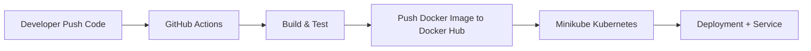

# DevOps Flask CI/CD + Kubernetes

## Overview
Project ini membangun **CI/CD pipeline lengkap** menggunakan GitHub Actions untuk otomatisasi build, test, dan push Docker image aplikasi Flask. Kemudian deploy ke Kubernetes (Minikube) dengan rolling update zero-downtime.  
Tujuannya: mengubah deployment manual menjadi satu command push-to-deploy — sesuai kebutuhan on-prem/hybrid.

## Tech Stack
- Backend: Flask (Python)
- Container: Docker
- CI/CD: GitHub Actions
- Orchestration: Kubernetes (Minikube)
- Documentation: Markdown + Mermaid

## Architecture Diagram

---
## Milestone 1 - Flask app
- Setup Repo Github
- Flask app sederhana dengan health check

### How to Run Locally
```bash
git clone https://github.com/seizenz7/devops-flask-ci-cd-kubernetes.git
cd devops-flask-ci-cd-kubernetes
python3 -m venv venv
source venv/bin/activate
pip install -r requirements.txt
python app.py
```

### Screenshots (Flask app)
Flask Home \
 \
Health Check \


### Challenges & Learning
- Challenge: Mengatur virtual environment dan GitHub repo di WSL Windows
- Learning: Menggunakan virtual environment + requirements.txt membuat project selalu reproducible dan mudah diaudit
---
## Milestone 2 - Docker
- Dockerfile dengan layer caching + HEALTHCHECK menggunakan /health endpoint
- Image berhasil di-build & di-run lokal

### How to Run with Docker
```bash
docker build --no-cache -t devops-flask:latest .
docker run -d -p 5000:5000 devops-flask
```

### Screenshots (Docker)


### Challenges & Learnings 
- Challenge: Health check status Unhealthy karena curl not found di container
- Learning: Selalu rebuild dengan --no-cache setelah ubah Dockerfile — ini kebiasaan penting untuk reproducibility di lingkungan on-prem
