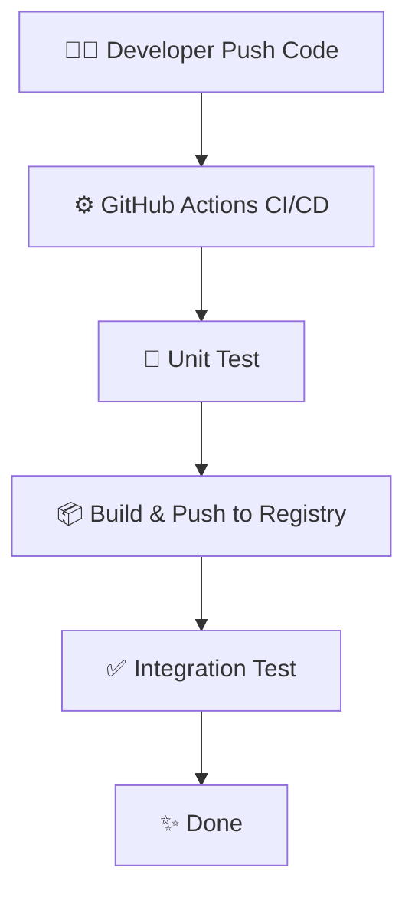

# DevOps Flask CI/CD + Kubernetes

## Overview
Project ini adalah prototype **DevOps Pipeline** untuk aplikasi Flask. Project ini membangun **CI/CD pipeline lengkap** menggunakan GitHub Actions untuk otomatisasi build, test, push Docker image dan simulasi Deployment (Integration Testing) menggunakan cluster KinD (Kubernetes in Docker). Kemudian deploy ke Kubernetes (Minikube) dengan rolling update zero-downtime.

Tujuannya: Mengubah deployment manual menjadi satu command push-to-deploy.

## Tech Stack

Backend: Flask (Python), Pytest (Unit Testing)

Container: Docker

CI/CD: GitHub Actions

Orchestration: Kubernetes (Minikube untuk lokal, KinD untuk CI/CD pipeline)

Configuration Management: Kustomize

Documentation: Markdown + Mermaid

## Flowchart Diagram

---
## Milestone 1 - Flask app
- Setup Repo Github
- Flask app sederhana dengan health check

### How to Run Locally
```bash
git clone https://github.com/seizenz7/devops-flask-ci-cd-kubernetes.git
cd devops-flask-ci-cd-kubernetes
python3 -m venv venv
source venv/bin/activate
pip install -r requirements.txt

# Run Unit Tests
pytest tests/ -v

# Run Application
python app.py
```

### Screenshots (Flask app)
Flask Home \
 \
Health Check \


### Challenges & Learning
- Challenge: Memastikan aplikasi Flask siap untuk production dan dapat diuji secara otomatis.
- Learning:
    - Menerapkan pytest sebagai unit test di awal pengembangan.
    - Penggunaan venv dan requirements.txt membuat project selalu reproducible dan mudah diaudit.
---
## Milestone 2 - Docker
- Dockerfile dengan layer caching + HEALTHCHECK menggunakan /health endpoint
- Image berhasil di-build & di-run lokal

### How to Run with Docker
```bash
docker build --no-cache -t devops-flask:latest .
docker run -d -p 5000:5000 devops-flask
```

### Screenshots (Docker)


### Best Practice Dockerfile (✓ Applied)
- Specific slim image: Menggunakan python:3.11-slim-bookworm untuk memangkas ukuran image (dari ~900MB ke ~150MB) dan memastikan patch keamanan terbaru.
- Layer caching: Meng-copy requirements.txt sebelum kode aplikasi agar build jauh lebih cepat saat hanya kode yang berubah.
- Non-root user: Menjalankan aplikasi sebagai appuser (UID 1000) untuk mencegah privilege escalation.
- Clean cache: Menghapus cache apt setelah instalasi dependencies.
- HEALTHCHECK: Membantu orchestrator (seperti Kubernetes) mendeteksi jika container mengalami hang.

### Challenges & Learnings 
- Challenge:
    - Menjaga ukuran image sekecil mungkin dan mematuhi prinsip keamanan (least privilege).
    - Health check status Unhealthy karena curl not found di container
    - Mengubah ke non-root user + clean cache
- Learning:
  - Selalu rebuild dengan --no-cache setelah ubah Dockerfile — ini kebiasaan penting untuk reproducibility di lingkungan on-prem
  - Penggunaan .dockerignore agar folder seperti venv atau .git tidak akan terikut, membengkakkan image dan berpotensi mengekspos data sensitif.

---

## Milestone 3 - GitHub Actions CI/CD 
- Pipeline otomatis yang terdiri dari 3 tahapan (Jobs): Test ➔ Build & Push ➔ Integration Test.
- Best practice: caching layer, multi-tag (latest + SHA) dan penerapan standar keamanan permissions: read-only untuk content repo.

### Screenshots (GitHub Actions)


### Challenges & Learnings 
- Challenge: 
    - Setup secrets dan caching Docker
    - Melakukan simulasi deployment Kubernetes secara otomatis di dalam server CI/CD (GitHub runner) yang memiliki resource terbatas.
- Learning:
    - GitHub Actions + layer caching membuat build jauh lebih cepat dan reproducible
    - Menggunakan fitur Immutable Tags (GitHub SHA) dikombinasikan dengan tag latest untuk memastikan traceability
    - Implementasi KinD (Kubernetes in Docker) memungkinkan untuk memvalidasi manifest dan menguji health probes secara nyata di dalam pipeline tanpa harus menyentuh production cluster

---

## Milestone 4 - Kubernetes 
- Declarative manifests (Deployment + Service)
- RollingUpdate zero-downtime
- Readiness & Liveness probes
- Non-root container (dari Dockerfile best practice)

### Screenshots (Kubernetes)


### Challenges & Learnings (Kubernetes)
- Challenge: Mengatur probes dan securityContext (`runAsNonRoot`, `readOnlyRootFilesystem`)
- Learning: Kubernetes declarative + rolling update 
---
## ***Key Takeaway Keseluruhan Project 1***
Project ini mengubah pola pikir saya dari sekadar "bisa menginstall Docker dan Kubernetes" menjadi paham DevOps Mindset sepenuhnya: mulai dari reproducibility, shift-left testing (pytest di pipeline), Security by Design (non-root & read-only FS), integrasi Kustomize, hingga Integration Testing otomatis menggunakan KinD.
